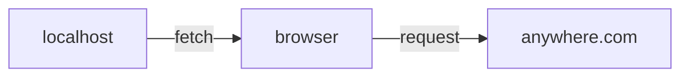
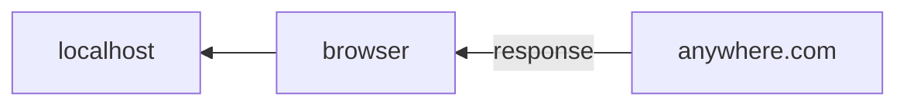
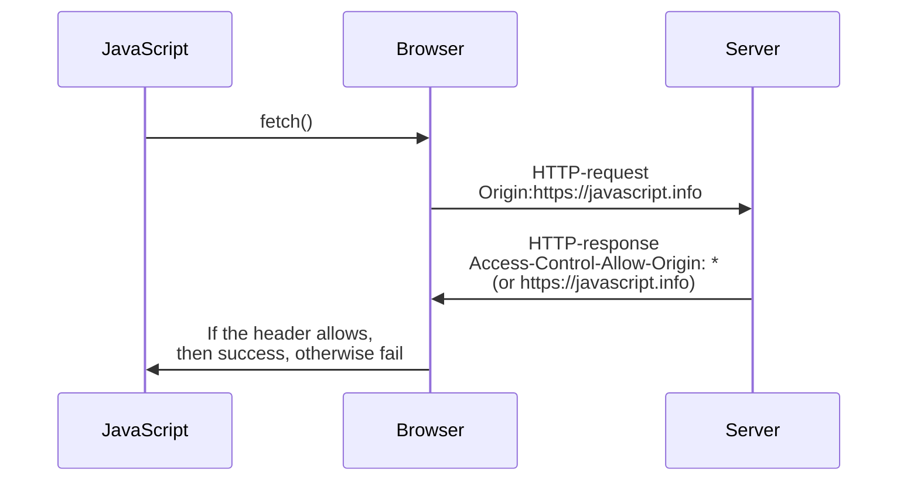

## Safe requests

There are two types of cross-origin requests:
1. Safe requests
2. All the others.

A request is safe if it satisfies two conditions:

1. Safe method: GET, POST, or HEAD
2. Safe headers - 
  * Accept,
  * Accept-Language,
  * Content-Language,
  * Content-Type with value ...

All other requests are considered unsafe.

The Essential difference is a safe request can be made with   
```<form>``` or ```<script>```   
without any special methods.

## CORS for safe requests

If a request is cross-origin the browser adds the ```Origin``` header.

```html
GET /request
HOST: anywhere.com
Origin: https://javascript.info
```




